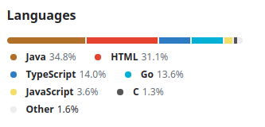

ER-π to test interleaving with exhaustive replay for RDL integration

Demo test: 
- from a CLI, command *redis-server*
- navigate from another CLI to the library direcoty where Makefile located 
- command *make all*
- Example_Go: open two CLIs inside **Library** directory and command *./r1.sh* and *./r2.sh*
- Example_Java: gradle test
- Example_JS: npm test
- *make clean* 
